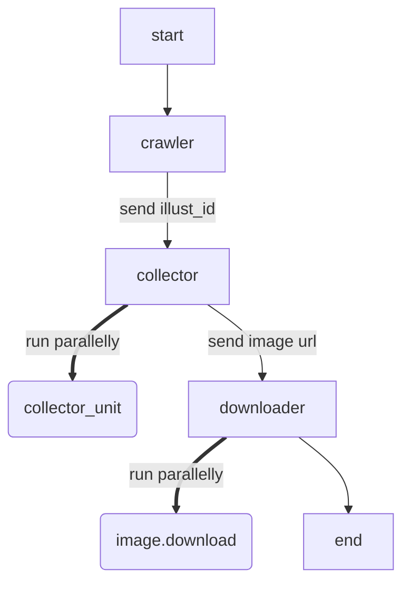

# Pixiv crawler

一个pixiv的爬虫

模块化程度高，耦合度低

例如有url的话可以考虑直接传入downloader这个多线程下载器（比如配合[Pxer](https://github.com/FoXZilla/Pxer)使用）



本来以为爬太快会被暂时ban ip，然后发现好像不需要顾虑这个，~~可以选择性忽略ip was banned的提示~~

~~如果遇到图只有半张的情况，大概是网不太好，~~现在确保size和response headers里的content-length一样大

[TOC]

### 版本记录

#### Ver 1.0

> - 支持爬取排行榜和个人收藏
>
> ​	其中每页收藏都支持多线程
>
> ​	在收集图片信息和下载时也支持多线程
>
> ​	但排行榜的每天不支持多线程

#### Ver 1.1

> - 把一些通用函数并入了`settings.py`
>
> - 把从json和page收集illust_id的模块整合到了collectunit，通过传入不同的selector来筛选不同的数据
>
> ​	`page.py`和`image_group.py`现在通过传入`page_selector`和`image_group_selector`来实现
>
> - 收藏与排行榜下载
>
> ​	bookmark: 支持每页收藏并行，传入`page_selector`
>
> ​	ranking: 支持每天的json并行，传入`ranking_selector`
>
> - 移除了对下载数量的精确中断
>
> ​	由于并行，无法精确中断
>
> ​	以50 items/json为例，只能保证下载数量为$\lceil \frac{x}{50} \rceil\times 50$
>
> - 单个画师所有作品下载


### 部署方法

Windows限定，~~不保证在其它平台可以使用~~

#### 1.安装依赖库

总之少哪个装哪个

- request

  `pip install requests`

- selenium

  `pip install selenium`

- chrome driver

  下载地址[Link](http://npm.taobao.org/mirrors/chromedriver/)，下载chrome对应的版本

  在windows环境建议直接把chromedriver.exe放入python的scripts目录

#### 2.运行

0. `settings.py`的设置

   > 这里没提到的都不用改，带:warning:的务必修改
   >
   > `USER_ID`:warning:: 这里改成自己的uid，在profile页面的url里可以找到
   >
   > `name`:warning::
   >
   > ​	在同目录下新建一个userdata.json，填入以下内容
   >
   > ​	这里的name填入自己的账号，应该是邮箱什么的
   >
   > ​	运行时载入成功会有'load userdata.json successfully!'反馈
   >
   > ```json
   > {
   >  "name":"xxxx@xxx"
   > }
   > ```
   >
   > `FAIL_TIMES`: 失败后尝试请求次数
   >
   > `DOWNLOAD_DELAY/FAIL_DELAY`: 下载/失败后延时
   >
   > `MAX_THREADS`: 最大并行线程数
   >
   > `IMAGES_STORE_PATH`: 图片保存目录，相对路径
   >
   > `START_DATE/DOMAIN`:warning:: 抓取排行榜开始日期与范围
   >
   > `PIXIV_MODE`:warning:: 设置排行榜类型
   >
   > `ARTWORKS_PER`:warning:: 榜的前x幅作品
   >
   > `PROXIES`:warning:: 填入自己的proxy设置，ss/ssr默认设置的话无需改动​ 
   >
   > `USER_DATA_DIR`:warning:: chrome个人配置的目录，用于login时调整chrome设置
   >
   > ​	一般来说是'C:\\Users\\xxxxx\\AppData\\Local\\Google\\Chrome\\User Data'
   
1. 获取cookies

   使用`login.py`，运行Login().login()

   ```python
   from login import Login
   Login().fetch()
   ```

   运行一次即可，保存在cookie.json

   务必先阅读注意事项1-4

2. 排行榜/个人收藏/画师作品的抓取

   见当前的`main.py`，需要提前配置好`settings.py`
   
   `ranking`
   
   ​	需要在`settings.py`中设置模式/日期/范围/每天下载数量
   
   ​	第二个参数为流量限制
   
   ```
   app = RankingCrawler(load_cookie(), 200)
   app.run()
   ```
   
   `bookmark`
   
   ​	需要在`settings.py`中设置好个人id
   
   ​	下载当前登录用户的公开个人收藏
   
   ​	第二个参数为数量限制，第三个参数为流量限制
   
   ```
   app = BookmarkCrawler(load_cookie(), 40, 4096)
   app.run()
   ```
   
   `user`
   
   ​	下载指定画师的所有作品
   
   ​	第一个参数为画师id，第三个参数为流量限制
   
   ```
   app = UserCrawler('23945843', load_cookie(), 200)
   app.run()
   ```
   
   

#### 3.注意事项:warning::warning::warning:

1. 确保chrome已经登录pixiv.net

   login模块使用selenium模拟chrome抓取cookies，会有弹窗

2. 在运行login模块时需要关闭所有chrome窗口

3. 需要手动检查cookies.json是否为空

   selenium模块处理状态码比较困难

   没有很好的办法判断网页是请求成功，还是无法访问，而且这里不会报错

4. cookies的过期时间很长

   基本上几天内用同一个cookie不会有大问题，等过期了再次抓取即可

### 基本功能

- [x] ~~模拟登录~~

  使用selenium抓取已登录的cookies

- [x] cookies

- [x] 爬取pixiv第一张图片

- [ ] proxy池

- [x] 多图 image_group

- [x] 排行榜 ranking_crawler

- [x] 个人收藏

- [x] fail log

- [ ] 个人关注

- [x] 某个画师作品

- [ ] ~~标签搜索~~（disallow in robots.txt）

- [x] 多线程

- [x] 流量控制

- [ ] tags

- [ ] 数据库构建

- [ ] cookies池


### 主要模块

#### 基础类

- selector function

> 用法见注释
>
> `image_group_selector`
>
> `ranking_selector`
>
> `user_selector`
>
> `page_selector`

- json sample

> `rank.json`:  ranking
>
> ​	request ".../ranking.php?p=1&format=json"
>
> `page.json`: used in image_group.py
>
> ​	from ".../artworks/xxxx"
>
> ​	request "..../ajax/illust/xxxx"
>
> `user.json`:
>
> ​	from "..../users/xxxx/illustrations"
>
> ​	request "...../ajax/user/xxxxx/profile/all?lang=zh"

- `settings.json`: 所有设置都在这里，见**部署方法**

- `login.py`:

​	无需传入参数 

​	使用selenium抓取已登录的cookies并保存在cookies.json

#### 图片收集/下载

- `image.py`: 

​	传入类似"xxxx://i.pximg.net/img-original/img/xxxxx/xxxxxx_p0.jpg"的url

​	图片类，提供下载方法，可以多线程执行

- `downloader.py`

​	下载器，可以多线程调度Image类

- `collector_unit.py`: 

​	一个通用的收集器单元，通过传入不同的selector来筛选数据

- `collector.py`

​	收集器，可以多线程调度ImageGroup类

#### 各种类型的爬虫

- `ranking_crawler.py`

​	需要传入cookie和capacity=1024

​	其中capacity为流量限制，默认1024MB，只计算图片大小而忽略request的一些占用	

​	爬取排行榜

- `bookmark_crawler.py`

​	传入cookie,num=200,capacity=1024

​	分别指定下载数量和大小

​	爬取个人公开的收藏

- `users_crawler.py`

​	传入画师id,cookie,capacity=1024

​	下载单个画师的所有作品

#### 主函数

- `main.py`

​	汇总各种爬虫的使用方法


### 附录

- `pixiv.net/robots.txt`

```
User-agent: *
Disallow: /rpc/index.php?mode=profile_module_illusts&user_id=*&illust_id=*
Disallow: /ajax/illust/*/recommend/init
Disallow: *return_to*
Disallow: /?return_to=
Disallow: /login.php?return_to=
Disallow: /index.php?return_to=

//搜索功能
Disallow: /tags/* * *
Disallow: /tags/*%20*%20*

Disallow: /users/*/followers
Disallow: /users/*/mypixiv
//别人的关注
Disallow: /users/*/bookmarks
Disallow: /novel/comments.php?id=


Disallow: /en/group

Disallow: /en/tags/* * *
Disallow: /en/tags/*%20*%20*

Disallow: /en/search/

Disallow: /en/users/*/followers
Disallow: /en/users/*/mypixiv
Disallow: /en/users/*/bookmarks
Disallow: /en/novel/comments.php?id=

Disallow: /fanbox/search
Disallow: /fanbox/tag
```

