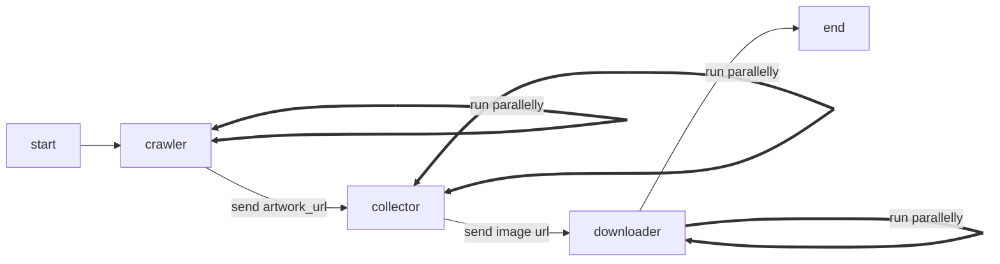
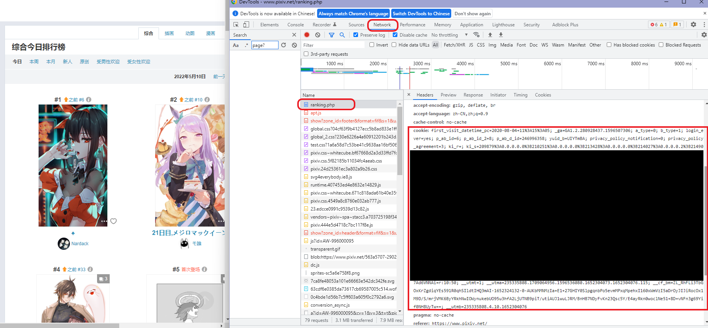

# Pixiv Crawler

 

一个使用`Python`实现的`Pixiv`爬虫

## Main Features

运行时输出参考下图（2x faster）


**支持功能**

- 每日/月/年的不同排行榜

- 个人收藏

- 特定画师的作品

- 特定关键词的作品（支持高级关键词搜索，例如`(Lucy OR 边缘行者) AND (5000users OR 10000users)`）

- 马赛克拼图（`image_mix`）

  

**设计思路**

- Notations

  - `artwork_id`: "93172108"

  - `artwork_url`: https://www.pixiv.net/artworks/93172108

    每个`artwork`可能包含多张图片

  - `image_url`: "https://i.pximg.net/img-original/img/2021/10/02/18/47/29/93172108_p1.jpg"

- 采用流水线设计

  不同阶段分别收集`artwork url`, `image url`，并传入下一阶段使用

- 模块化程度高，耦合度低

  例如已有`image url`（e.g., 配合[Pxer](https://github.com/FoXZilla/Pxer)使用），则可以考虑直接传入`downloader`下载




## 目录结构

- `./image_mix`：马赛克拼图

- `./pixiv_crawler`：`Pixiv`爬虫

- `./templates`

    `Pixiv`网站部分`json`, `html`的样例
    
    说明见`./pixiv_crawler/collector/selectors.py`
    
    


## 如何使用

:warning: <u>此处仅含爬虫的使用教程</u>，马赛克拼图使用教程见`./image_mix/README.md`

### 1. 安装Python及其依赖库

- `Python >= 3.9`
- `pip install requirements.txt -r `

### 2. 修改配置文件

配置文件为`./pixiv_crawler/config.py`，含:warning:项必须修改

- `MODE_CONFIG`部分

  <u>该设置仅适用于抓取排行榜图片</u>

  - `START_DATE`: 排行榜开始日期 :warning:
  - `RANGE`: 日期范围 :warning:
  - `MODE`: 哪个类型的排行榜（参考文件中`RANKING_MODES`） :warning:
  - `CONTENT_MODE`: 下载插画、漫画或是全部类型的作品（参考文件中`CONTENT_MODES`） :warning:
  - `N_ARTWORK`: 排行榜前`k`幅作品 :warning:

- `OUTPUT_CONFIG`部分

  该设置用于控制输出信息程度，可用于调试

  - `VERBOSE`: 输出最多的信息（不建议开启）
  - `PRINT_ERROR`: 输出遇到异常的类型（可用于调试，偶尔`TimeOut`属于正常情况）

- `NETWORK_CONFIG`部分

  - `PROXY`: 代理设置（`Clash`无需修改，`SSR`需要修改端口号） :warning:
  - `HEADER`: 基础请求头，目前仅含浏览器头

- `USER_CONFIG`部分

  - `USER_ID`: 修改成自己的`uid`，参考个人资料页面的网址`https://www.pixiv.net/users/{UID}` :warning:

  - `COOKIE`: 配置种最关键的一项 :warning::warning::warning:

    1. 打开浏览器的`DevTools`（一般为F12），切换到`Network`栏

    2. 访问排行榜并刷新页面，在`DevTools`中找到`ranking.php`

       

       将`cookie:`后面所有的字符（最大的红框所示）复制到配置的`COOKIE`中 :warning:

- `DOWNLOAD_CONFIG`部分

  - `STORE_PATH`: 图片保存位置
  - `N_TIMES`: 下载失败后的重复请求次数
  - `WITH_TAG`: 是否需要抓取标签
  - `FAIL_DELAY`: 下载失败后延时（秒）
  - `N_THREAD`: 并行下载的线程数量（根据CPU核数调整） :warning:
  - `THREAD_DELAY`: 每个线程启动的延时（秒）

### 3. 修改主程序

参考`./pixiv_crawler/main.py`中注释代码

`capacity`参数用于限制下载流量

- 下载排行榜作品

  正确配置`MODE_CONFIG`，修改主程序

  ```python
  app = RankingCrawler(capacity=200)
  app.run()
  ```

- 下载个人公开收藏作品

  正确配置`USER_CONFIG`，修改主程序

  `n_images`参数用于限制最大下载数量

  ```python
  app = BookmarkCrawler(n_images=20, capacity=200)
  app.run()
  ```

- 下载某位画师的作品

  `artist_id`参数为画师的`uid`

  ```python
  app = UserCrawler(artist_id="32548944", capacity=200)
  app.run()
  ```

- 下载某个关键词的作品

  **注**：按照热门度排序需要`premium`账户

  正确配置`USER_CONFIG`，修改主程序

  `keyword`参数为关键词

  `n_images`参数用于限制最大下载数量

  ```python
  app = KeywordCrawler(keyword="(Lucy OR 边缘行者) AND (5000users OR 10000users)",
                       order=False, mode=["safe", "r18", "all"][-1], n_images=20, capacity=200)
  app.run()
  ```

### 4. 运行

`python main.py`

### 5. 注意事项 :warning:

- `COOKIE`过期时间较长，一般几天内可重复使用
