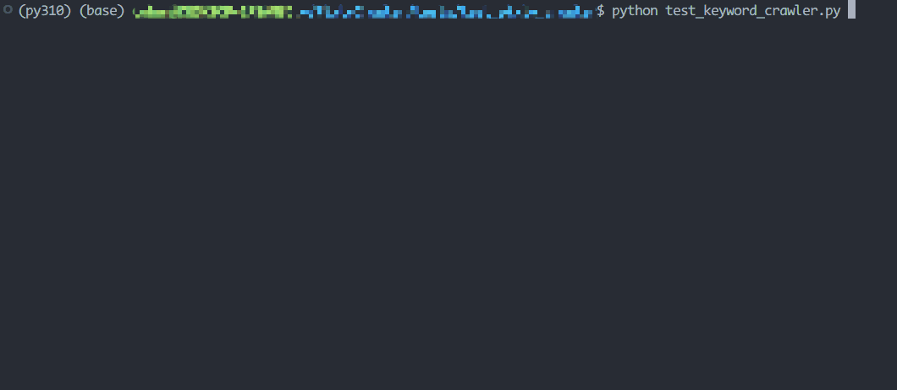

# Pixiv Utils

[](https://github.com/CWHer/PixivCrawler/actions/workflows/test_on_schedule.yml)

'

This Chinese version of README can be found [here](./README_CN.md).

## About

Pixiv Utils implemented in Python, including **Pixiv Crawler** and **Mosaic Puzzles**, support for rankings, personal bookmarks, artist works and keyword search for personalized filtering, and provide high-performance multi-threaded parallel download. 🤗

This GIF depicts a sample run in normal speed,



## Features

- **Pixiv Crawler**

  - Ranking lists for daily/monthly/yearly...

  - Personal bookmarks

  - Specific artist's artworks

  - Specific keyword's artworks (support advanced keyword search, e.g., `(Lucy OR 边缘行者) AND (5000users OR 10000users)`)

  - Parallel download with multi-threading

- **Mosaic Puzzles**

  

## Installation

### Install from PyPI (Recommended)

```bash
pip install pixiv-utils
```

### Install from source

```bash
git clone git@github.com:CWHer/PixivCrawler.git
pip install -v .
```

## Quick Start

Please refer to [tutorial](./tutorial.py) for comprehensive instructions.

Note: This section only contains the usage of **Pixiv Crawler**. For the usage of **Mosaic Puzzles**, please refer to [Mosaic Puzzles Doc](./docs/IMAGE_MIX.md).

```python
import datetime

from pixiv_utils.pixiv_crawler import (
    RankingCrawler,
    checkDir,
    displayAllConfig,
    download_config,
    network_config,
    ranking_config,
    user_config,
)

if __name__ == "__main__":
    network_config.proxy["https"] = "127.0.0.1:7890"
    user_config.user_id = ""
    user_config.cookie = ""
    download_config.with_tag = False
    ranking_config.start_date = datetime.date(2024, 5, 1)
    ranking_config.range = 2
    ranking_config.mode = "weekly"
    ranking_config.content_mode = "illust"
    ranking_config.num_artwork = 50

    displayAllConfig()
    checkDir(download_config.store_path)

    app = RankingCrawler(capacity=200)
    app.run()
```

### Learn about the configurations

The configurations locate at [`config.py`](./pixiv_utils/pixiv_crawler/config.py), which contains several items that should potentially be modified, denoted by :warning:. You can simply import these configurations, modify them like the example above, and use `displayAllConfig()` to check if they are correct.

- `RankingConfig`

  ```python
  import ranking_config from pixiv_utils.pixiv_crawler
  ```

  **NOTE:** This config is only activated when downloading the ranking list.

  - `ranking_config.start_date: datetime.date`: The start date of the ranking list :warning:

  - `ranking_config.range: int`: The date range of the ranking list :warning: `[start, start + range - 1]`

  - `ranking_config.mode: str`: The type of ranking list :warning:, which can be chosen from

    ```python
    ranking_modes: Tuple = (
        "daily",
        "weekly",
        "monthly",
        "male",
        "female",
        "daily_ai",
        "daily_r18",
        "weekly_r18",
        "male_r18",
        "female_r18",
        "daily_r18_ai",
    )
    ```

  - `ranking_config.content_mode: str`: The type of content in the ranking list :warning:, which can be chosen from

    ```python
    content_modes: Tuple = ("all", "illust", "manga", "ugoira")
    ```

  - `ranking_config.num_artwork: int`: The number of artworks to be downloaded in each ranking list :warning:

- `NetworkConfig`

  ```python
   import network_config from pixiv_utils.pixiv_crawler
  ```

  - `network_config.proxy: Dict`: The proxy configuration :warning:

    ```python
    # For example, to turn off the proxy
    network_config.proxy["https"] = ""
    ```

  - `network_config.headers: Dict`: The headers used in the request.

- `UserConfig`

  ```python
  import user_config from pixiv_utils.pixiv_crawler
  ```

  **NOTE:** User-specific configurations are required when downloading personal bookmarks or R18 content.

  - `user_config.user_id: str`: The user ID of the Pixiv account :warning:. You can find it in the URL of your profile page, `https://www.pixiv.net/users/{UID}`.

  - `user_config.cookie: str`: The cookie of your Pixiv account :warning:

    1. Open the browser's `DevTools` (usually F12) and switch to the `Network` tab.

    2. Visit the ranking list and refresh the page. Find `ranking.php` in `DevTools`.

       

       Copy all characters after `cookie:` (as shown in the red box) to the `COOKIE` configuration

- `DownloadConfig`

  ```python
  import download_config from pixiv_utils.pixiv_crawler
  ```

  - `download_config.timeout: float`: The timeout of the request.

  - `download_config.retry_times: int`: The number of retries after a request fails.

  - `download_config.fail_delay: float`: The delay after a request fails.

  - `download_config.store_path: str`: The path to store the downloaded images :warning:

  - `download_config.with_tag: bool`: Whether to download image tags to `tags.json`. :warning:

  - `download_config.num_threads: int`: The number of threads for parallel download :warning:

  - `download_config.thread_delay: float`: The delay for each thread to start.

- `DebugConfig`

  ```python
  import debug_config from pixiv_utils.pixiv_crawler
  ```

  - `debug_config.verbose: bool`: Whether to print debug information.

  - `debug_config.show_error: bool`: Whether to print detailed error information.

### Create a crawler instance

- `RankingCrawler`

  ```python
  """
  Download artworks from rankings

  NOTE: Require cookie for R18 images!

  Args:
      capacity (int): flow capacity, default is 1024MB
  """
  app = RankingCrawler(capacity=200)
  app.run()
  ```

- `BookmarkCrawler`

  ```python
  """
  Download artworks from public bookmarks

  NOTE: Require cookie!

  Args:
      n_images (int): max download number, default is 200
      capacity (int): flow capacity, default is 1024MB
  """
  app = BookmarkCrawler(n_images=20, capacity=200)
  app.run()
  ```

- `UserCrawler`

  ```python
  """
  Download artworks from a single artist

  NOTE: Require cookie for R18 images!

  Args:
      artist_id (str): artist id
      capacity (int): flow capacity, default is 1024MB
  """
  app = UserCrawler(artist_id="32548944", capacity=200)
  app.run()
  ```

- `KeywordCrawler`

  ```python
  """
  Download search results of a keyword (sorted by popularity if order=True)
  Support advanced search, e.g. "(Lucy OR 边缘行者) AND (5000users OR 10000users)", refer to https://www.pixiv.help/hc/en-us/articles/235646387-I-would-like-to-know-how-to-search-for-content-on-pixiv

  NOTE: Require cookie for R18 images!
  NOTE: Require premium account for popularity sorting!

  Args:
      keyword (str): search keyword
      order (bool): order by popularity or not, default is False
      mode (str): content mode, default is "safe", support ["safe", "r18", "all"]
      n_images (int): max download number, default is 200
      capacity (int): flow capacity, default is 1024MB
  """
  app = KeywordCrawler(
      keyword="(Lucy OR 边缘行者) AND (5000users OR 10000users)",
      order=False,
      mode=["safe", "r18", "all"][-1],
      n_images=20,
      capacity=200,
  )
  app.run()
  ```

### Run

Just run your script. :laughing:

### Tips

- `COOKIE` expiration time is relatively long, and can be reused within a few days.

- Use `displayAllConfig()` to display all configurations and check if they are correct.

## Documentation

- [Tutorial](./tutorial.py): Quick start tutorial of Pixiv Crawler

- [Configuration](./pixiv_utils/pixiv_crawler/config.py): Configuration of Pixiv Crawler

- [Pixiv Crawler](./docs/PIXIV_CRAWLER.md): Detailed instructions for Pixiv Crawler

- [Mosaic Puzzles](./docs/IMAGE_MIX.md): Detailed instructions for Mosaic Puzzles

## Star History

[](https://star-history.com/#CWHer/PixivCrawler&Date)
